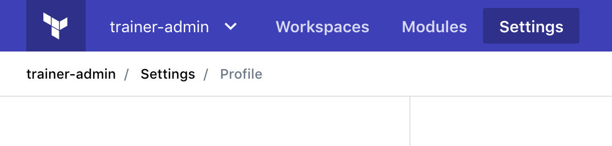

# Terraform Enterprise - VCS Connection

## Expected Outcome

In this challenge, you will connect TFE to your personal github account.

## How to

### Create the VCS Connection

1. Login to github in one browser tab.
2. Login to TFE in another browser tab.
3. Within TFE, navigate to the settings page:

4. Click "VCS Providers" link:

5. Following the instructions on the documents page <https://www.terraform.io/docs/cloud/vcs/github.html>

> The process involves several back and forth changes and is documented well in the link.

### Verify Connection

Navigate to <https://TFE_HOSTNAME> and click "+ New Workspace".

Click the VCS Connection in the "Source" section.

Verify you can see repositories:

If you can see repositories then you are good :+1:.

In the next lab you will create a repo and workspace.
