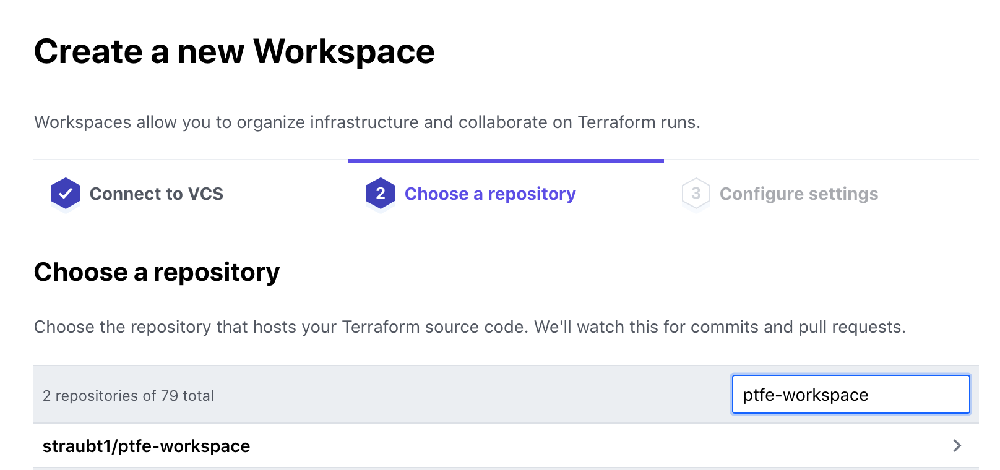
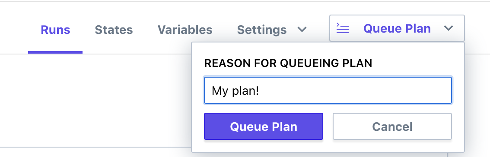
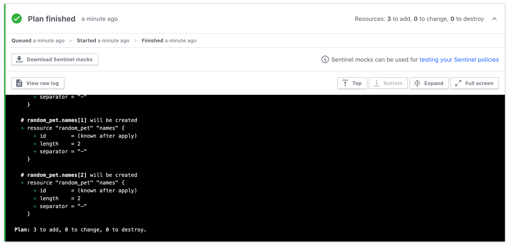
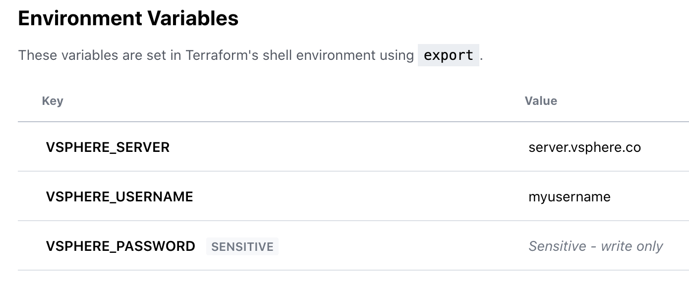

# Terraform Enterprise - Workspaces

## Expected Outcome

In this challenge, you will create a repository, a TFE workspace, and link them together.

## How to

### [GitHub] Create a new github repository

Login to github and create a new repository by navigating to <https://github.com/new>.

Use the following settings:
- `name` = "ptfe-workspace"
- Public repo
- Check "Initialize this repository with a README"
- Add `.gitignore` of type "Terraform"


Once created, clone the repository to your local machine.

### [TFE] Create a Workspace

Login to TFE and click the "+ New Workspace" button.

Select the VCS Connection to github.



In the repository section:

* Click link "Advanced Options" to show all
* Enter the name of the repository you created above
* Set the working directory to "/first-workspace"


### [Local] Update your repository

In your repository, create a folder called "first-workspace" and then create a `main.tf` file with the following contents:

```hcl
variable "name_count" {
  description = "The number of names to produce."
  default     = 3
}

variable "name_prefix" {
  description = "The prefix string to start each name with."
  default     = null
}

resource "random_pet" "names" {
  count  = var.name_count
  prefix = var.name_prefix
}

output "names" {
  value = random_pet.names.*.id
}
```

Commit the changes:

```sh
git add *
git commit -m "My First Workspace"
git push origin master
```

### [TFE] Queue a Plan

Back in your TFE Workspace, navigate to your workspace.



Verify the plan succeeded, it should look something like this:



Discard the the Run.

### [TFE] Workspace Variables

Go to the "Variables" tab.

Enter the following variables in the Terraform Variables section:

- "name_count" = <a number between 1 and 10>
- "name_prefix" = "<insert your username>"


### [TFE] Apply

Back in your TFE Workspace, queue another plan.

Once the plan succeeds you should see a different output than the first plan.

Confirm the plan, by clicking "Confirm & Apply".

Verify the outputs are as expected.


### Extra Credit

1. Find the workspace id (hint: it will start with "ws-").
2. Commit a change to source control, what happens?
3. Queue two plans, can you apply them out of order?
4. Check out the state file and explore version differences.

## How To (Phase 2)

### [Local] Update your Repository

In your repository, create a folder called "app-vm-dev" and then create a `main.tf` file with the following contents (be sure to update the DATASTORE_NAME and VM_NAME):

```hcl
# Provider Credentials can be loaded via
# export VSPHERE_SERVER=""
# export VSPHERE_USER=""
# export VSPHERE_PASSWORD=""
provider "vsphere" {
  allow_unverified_ssl = true
}

locals {
  datacenter_name      = "Datacenter"
  cluster_name         = "East"
  datastore_name       = "<DATASTORE_NAME>"
  network_name         = "VM Network"
  virtual_machine_name = "<VM_NAME>"
}

data "vsphere_datacenter" "dc" {
  name = local.datacenter_name
}

data "vsphere_compute_cluster" "cluster" {
  name          = local.cluster_name
  datacenter_id = data.vsphere_datacenter.dc.id
}

data "vsphere_datastore" "datastore" {
  name          = local.datastore_name
  datacenter_id = data.vsphere_datacenter.dc.id
}

data "vsphere_network" "network" {
  name          = local.network_name
  datacenter_id = data.vsphere_datacenter.dc.id
}

resource "vsphere_virtual_machine" "vm" {
  name             = local.virtual_machine_name
  resource_pool_id = data.vsphere_compute_cluster.cluster.resource_pool_id
  datastore_id     = data.vsphere_datastore.datastore.id
  num_cpus         = 2
  memory           = 1024
  guest_id         = "other3xLinux64Guest"

  network_interface {
    network_id = data.vsphere_network.network.id
  }

  wait_for_guest_net_timeout = 0

  disk {
    label = "disk0"
    size  = 20
  }
}
```

Commit the changes:

```sh
git add *
git commit -m "VSphere Workspace"
git push origin master
```

### [TFE] Create a Workspace

Login to TFE and click the "+ New Workspace" button.

Create another workspace, similar to above, with the following changes:

* Name the workspace "app-vm-dev"
* Use the same repository (ptfe-workspace)
* Point the workspace to the repository working directory of `/app-vm-dev`

### [TFE] Add Environment Variables

Enter the following into the Environment Variables section:

```sh
VSPHERE_SERVER=
VSPHERE_USER=
VSPHERE_PASSWORD=
```

> For the password environment variable, be sure to check the box "sensitive".



### [TFE] Plan and Apply

Queue another plan, if all looks good, Apply!

### [TFE] Destroy

In your 'app-vm-dev' Workspace, navigate to the Variables page.

Add a new Environment Variable: "CONFIRM_DESTROY = 1"

Click the Workspace "Setting" menu -> "Destruction and Deletion"


Click the "Queue destroy plan" to queue a destructive plan.


If the destroy plan looks good, apply it.

### Extra Credit

1. Extract the `local` variables to Terraform variables.
2. Set the workspace variable assignments to the newly created Terraform variables.

## Resources

[Random Terraform Provider](https://registry.terraform.io/providers/hashicorp/random)
