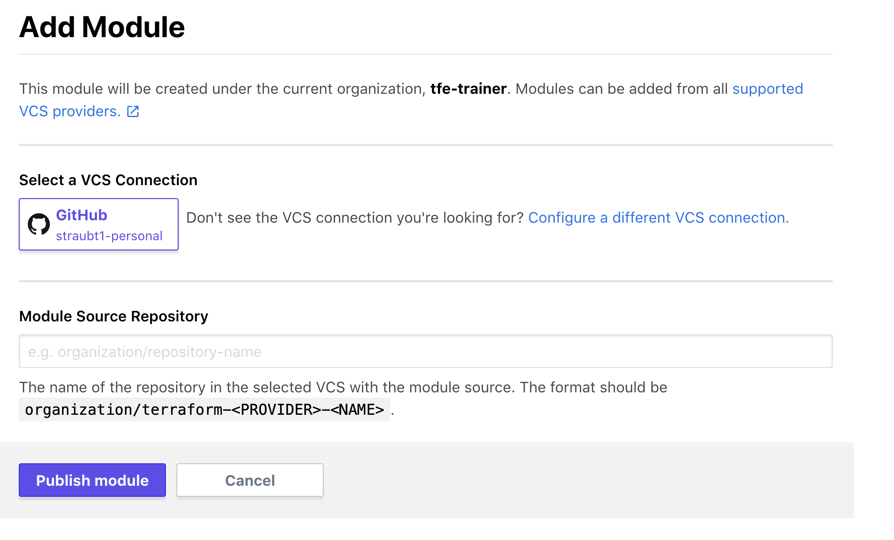

# Terraform Enterprise - Private Module Registry

## Expected Outcome

In this challenge you will register a module with your Private Module Registry then reference it in a workspace.

## How to:

### Create a Module Repository

Create a new GitHub repository, similar to early labs, with the name "terraform-vsphere-vm".

Create a single `main.tf` with the following contents:

```hcl
variable "datacenter_name" {}
variable "cluster_name" {}
variable "datastore_name" {}
variable "network_name" {}
variable "virtual_machine_name" {}

data "vsphere_datacenter" "dc" {
  name = var.datacenter_name
}

data "vsphere_compute_cluster" "cluster" {
  name          = var.cluster_name
  datacenter_id = data.vsphere_datacenter.dc.id
}

data "vsphere_datastore" "datastore" {
  name          = var.datastore_name
  datacenter_id = data.vsphere_datacenter.dc.id
}

data "vsphere_network" "network" {
  name          = var.network_name
  datacenter_id = data.vsphere_datacenter.dc.id
}

resource "vsphere_virtual_machine" "vm" {
  name             = var.virtual_machine_name
  resource_pool_id = data.vsphere_compute_cluster.cluster.resource_pool_id
  datastore_id     = data.vsphere_datastore.datastore.id
  num_cpus         = 2
  memory           = 1024
  guest_id         = "other3xLinux64Guest"

  network_interface {
    network_id = data.vsphere_network.network.id
  }

  wait_for_guest_net_timeout = 0

  disk {
    label = "disk0"
    size  = 20
  }
}
```

Commit the changes:

```sh
git add *
git commit -m "My First Module"
git push origin master
```

### Update github repository

Back in your `ptfe-workspace` repository created earlier.

Add a new folder called `app-vm-dev-modules`.

Create a single `main.tf` file with the following contents:

```hcl
# Provider Credentials can be loaded via
# export VSPHERE_SERVER=""
# export VSPHERE_USER=""
# export VSPHERE_PASSWORD=""
provider "vsphere" {
  allow_unverified_ssl = true
}

locals {
  datacenter_name      = "Datacenter"
  cluster_name         = "East"
  datastore_name       = "<DATASTORE_NAME>"
  network_name         = "VM Network"
  virtual_machine_name = "<VM_NAME>"
}

module "vm" {
  source  = "TFE_HOSTNAME/YOUR_ORG_NAME/vm/vsphere"
  version = "0.0.1"

  datacenter_name      = local.datacenter_name
  cluster_name         = local.cluster_name
  datastore_name       = local.datastore_name
  network_name         = local.network_name
  virtual_machine_name = local.virtual_machine_name
}
```

Update the local variables and the `source` argument on the module declaration to your hostname and organization.

Commit the file and check the code into github.

### Create a workspace

Create a TFE workspace that uses the VSC connection to load your repository.

Select the repository and name the workspace "ptfe-workspace-modules" and select the working directory as "/app-vm-dev-modules".


### Add Modules

Before we can use our new module, we need to add it to the Private Module Registry.

Navigate back to Terraform Enterprise and click the "Modules" menu at the top of the page. From there click the "+ Add Module" button.



Select the repository you created above ("terraform-vsphere-vm").


> Note: You will see your github user name since the repo is in your github account.

Click "Publish Module".

This will query the repository for necessary files and tags used for versioning.

> Note: this could take a few minutes to complete.

Congrats, you are done!

Ok, not really...

We need to tag the repository to be able to publish a version.

```sh
git tag v0.0.1 master
git push origin v0.0.1
```

### Configure Workspace Variables

Navigate back to your "ptfe-workspace-modules" workspace.


Set Environment Variables for your VSphere provider (be sure check the 'sensitive' checkbox to hide the password):

- VSPHERE_SERVER
- VSPHERE_USER
- VSPHERE_PASSWORD

### Run a Plan

Click the "Queue Plan" button.


Wait for the Plan to complete.

You should see several additions to deploy your networking.

### Apply the Plan (Optional)

Approve the plan and apply it.

Watch the apply progress and complete.

## Extra Credit

1. Make a change to a module repository and tag it in such a way that the change shows in your Private Module Registry.
2. Extra workspace locals into Terraform Variables.

## Clean Up (if you ran apply)

Add an Environment variable to your workspace "CONFIRM_DESTROY=1".

Navigate to the workspace "Settings" -> "Destruction and Deletion".

Click Queue Destroy Plan.

Once the plan completes, apply it to destroy your infrastructure.

## Resources

- [Private Registries](https://www.terraform.io/docs/registry/private.html)
- [Publishing Modules](https://www.terraform.io/docs/registry/modules/publish.html)
