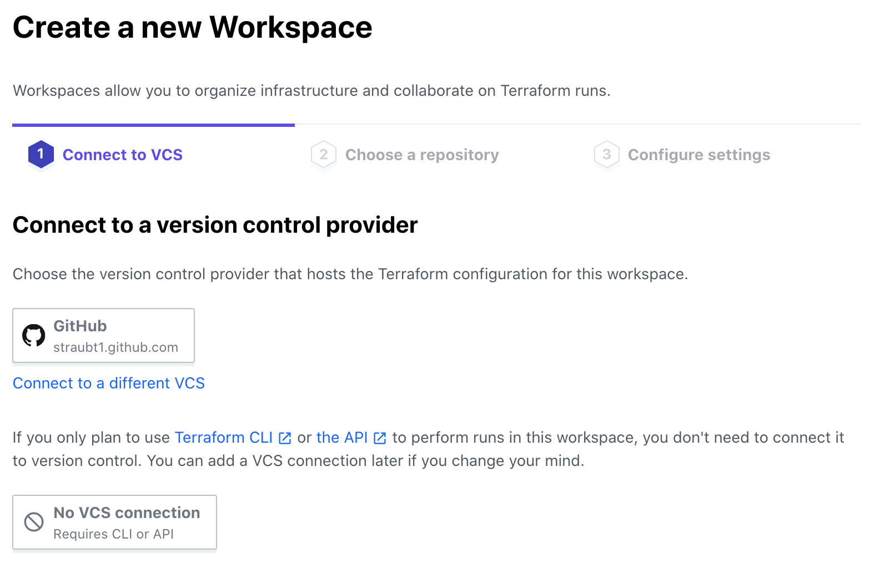

# TFE CLI-driven Run

## Expected Outcome

In this lab, we will invoke a Terraform run on TFE via your local Terraform client (Terraform OSS binary). This is also referred to as the _CLI-driven run_.


## How To

1. Login to TFE and click the "+ New Workspace" button.
2. In the **Connect to VCS** section, click the "No VCS Connection" button.

3. Enter the name `tfecli-test-run` for the Workspace.
4. Create a new directory locally on your workstation named `tfecli-test-run` and create a `main.tf` within it that will provision something from Terraform.

**main.tf**
```
resource "random_shuffle" "character" {
  input = [
    "Walter White",
    "Skyler White",
    "Jesse Pinkman",
    "Marie Schrader",
    "Hank Schrader",
    "Saul Goodman",
  ]
  result_count = 1
}

output "favorite_character" {
  value = random_shuffle.character.result
}
```

5. Within the same local working directory, create a `backend.tf` file to tell your local Terraform client how to reach your TFE instance:

**backend.tf**
```
terraform {
  backend "remote" {
    hostname     = "<TFE_HOSTNAME>"
    organization = "<TFE_ORGANIZATION_NAME>"
    token        = "<TFE_TOKEN>"

    workspaces {
      name = "tfecli-test-run"
    }
  }
}
```

- `TFE_HOSTNAME` is the hostname of your TFE
- `TFE_ORGANIZATION_NAME` is your specific TFE Organization name
- `TFE_TOKEN` a user API token retrieved from TFE

> Note: Be sure the workspace name matches what you created above.

6. `terraform init`
7. `terraform plan` - refresh the TFE UI and look for the running plan within your TFE Workspace
8. `terraform apply` - refresh the TFE UI and look for the running apply within your TFE Workspace


## Summary

Step 5 is the key concept with the _CLI-driven run_ method. We need a `backend.tf` file so the local Terraform client knows where to make its API calls against TFE, and we also need a TFE API token so we can properly authenticate to our TFE instance.  

It is also important to note that we _did not_ connect our Workspace to a VCS repo.  This is because the Terraform client takes care of compressing and sending the code to the TFE workspace via the TFE API.

This method can be run locally as we just demonstrated, or it can be executed from a build script/ CI pipeline.

### Extra Credit

1. Play with the `terraform taint` command to get a new favorite character to display at random.
2. Update the count variable locally and re run a plan and apply.
3. View the state file in the TFE Run.
4. How does the CLI Driven workflow compare to the API Driven workflow?

## Resources

[TFE CLI-driven Run Workflow](https://www.terraform.io/docs/cloud/run/cli.html)
[TFE API-driven Run Workflow](https://www.terraform.io/docs/cloud/run/api.html)