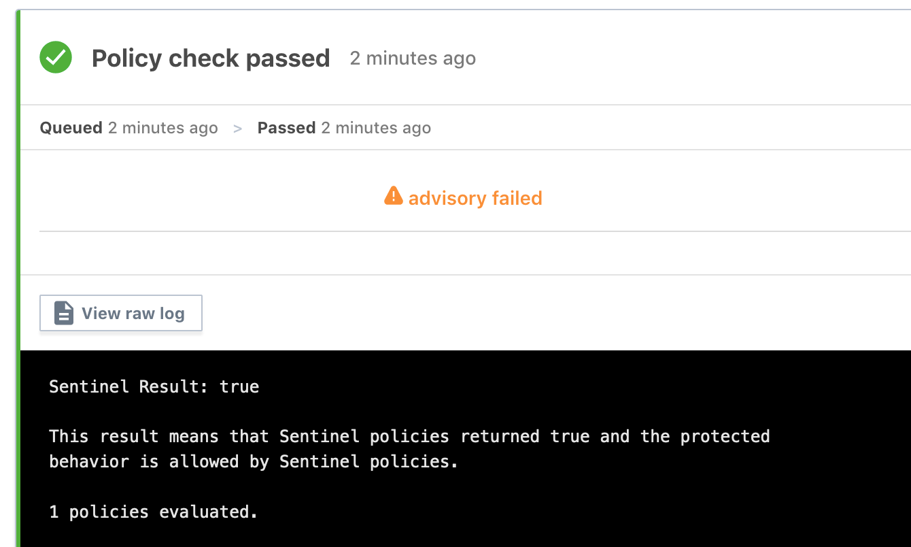
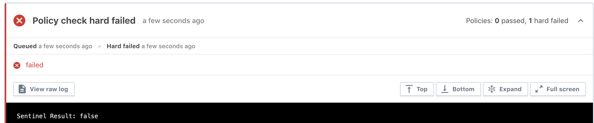

# Terraform Enterprise - Sentinel Policy Use

## Expected Outcome

In this challenge, you will see how you can apply policies using Sentinel Policy-as-Code.

## How to

### View Policies

In the Terraform Enterprise web app, click on your organization -> Organization Settings

<https://TFE_HOSTNAME/YOUR_ORG_NAME/settings/policies>


### Create Policy Set

First we need a place to stor our policies, namely a Policy Set.

On the left menu, click the "Policy set" tab.

Click "Create new policy set"


Create the following policy:


Create the following policy:

__Name:__ GlobalWorkspacePolicies

__Description:__ Global policies.

__Policy Set Source__: Select Upload Via API

__Scope of Policies:__ Select -> "Policies enforced on all workspaces"

__Policies:__ Select the Policy created above -> Click "Add"


### Create Policy

Now lets create a Policy to enforce governance.

Click "Create new policy"


Create the following policy:

__Policy Name:__ RestrictCpuAndMemory

__Description:__ Policy limiting compute consumption

__Policy Enforcement:__ advisory (logging only)

__Policy Code:__

```hcl
# This policy uses the Sentinel tfplan import to require that
# all VMware VMs obey CPU and memory limits

##### Imports #####

import "tfplan"
import "strings"

##### Functions #####

# Find all resources of a specific type from all modules using the tfplan import
find_resources_from_plan = func(type) {

  resources = {}

  # Iterate over all modules in the tfplan import
  for tfplan.module_paths as path {
    # Iterate over the named resources of desired type in the module
    for tfplan.module(path).resources[type] else {} as name, instances {
      # Iterate over resource instances
      for instances as index, r {

        # Get the address of the instance
        if length(path) == 0 {
          # root module
          address = type + "." + name + "[" + string(index) + "]"
        } else {
          # non-root module
          address = "module." + strings.join(path, ".module.") + "." +
                    type + "." + name + "[" + string(index) + "]"
        }

        # Add the instance to resources map, setting the key to the address
        resources[address] = r
      }
    }
  }

  return resources
}

# Validate that all instances of a specified resource type being modified have
# a specified top-level attribute with a value less than or equal to a max value
validate_attribute_less_than_value = func(type, attribute, max_value) {

  validated = true

  # Get all resource instances of the specified type
  resource_instances = find_resources_from_plan(type)

  # Loop through the resource instances
  for resource_instances as address, r {

    # Skip resource instances that are being destroyed
    # to avoid unnecessary policy violations.
    # Used to be: if length(r.diff) == 0
    if r.destroy and not r.requires_new {
      print("Skipping resource", address, "that is being destroyed.")
      continue
    }

    # Determine if the attribute is computed
    if r.diff[attribute].computed else false is true {
      print("Resource", address, "has attribute", attribute,
            "that is computed.")
      # If you want computed values to cause the policy to fail,
      # uncomment the next line.
      # validated = false
    } else {
      # Validate that the attribute exists
      if r.applied[attribute] else null is not null {
        # Validate that each instance has desired value
        if float(r.applied[attribute]) > max_value {
          print("Resource", address, "has attribute", attribute, "with value",
                r.applied[attribute],"that is bigger than the maximum allowed",
                "value:", max_value)
          validated = false
        }
      } else {
        # The attribute did not exist
        print("Resource", address, "is missing attribute", attribute)
        validated = false
      } // end attribute exists check

    } // end computed check

  } // end resource instances

  return validated
}

##### Rules #####

# Call the validation functions
valid_cpu = validate_attribute_less_than_value("vsphere_virtual_machine", "num_cpus", 1)
valid_memory = validate_attribute_less_than_value("vsphere_virtual_machine", "memory", 512)

# Main rule
main = rule {
  valid_cpu and valid_memory
}
```

__Policy Sets__: Select the Policy Set we just created "GlobalWorkspacePolicies". (And be sure to click the add button to the right)

### Run a Plan

> Note: be sure to discard any existing plans.

Navigate to your "app-vm-dev" and queue a plan.

### Review the Plan

Will see the plan was successful but there was a policy failure, however the option to Apply is still available. Why is that?



**Discard the plan.**

### Update the Policy

Navigate back the policy definition (/settings/policies)

Update the Policy Enforcement to be `hard-mandatory`.

### Run a Plan

Queue a plan for the workspace.

### Review the Plan

This time the the run fails due to the hard enforcement.



## Advanced areas to explore

1. Write another Sentinel Policy restricting VM disk size.

## Resources

- [Policy Examples](https://github.com/hashicorp/terraform-guides/tree/master/governance/second-generation)
- [Sentinel Language Spec](https://docs.hashicorp.com/sentinel/language/spec)
